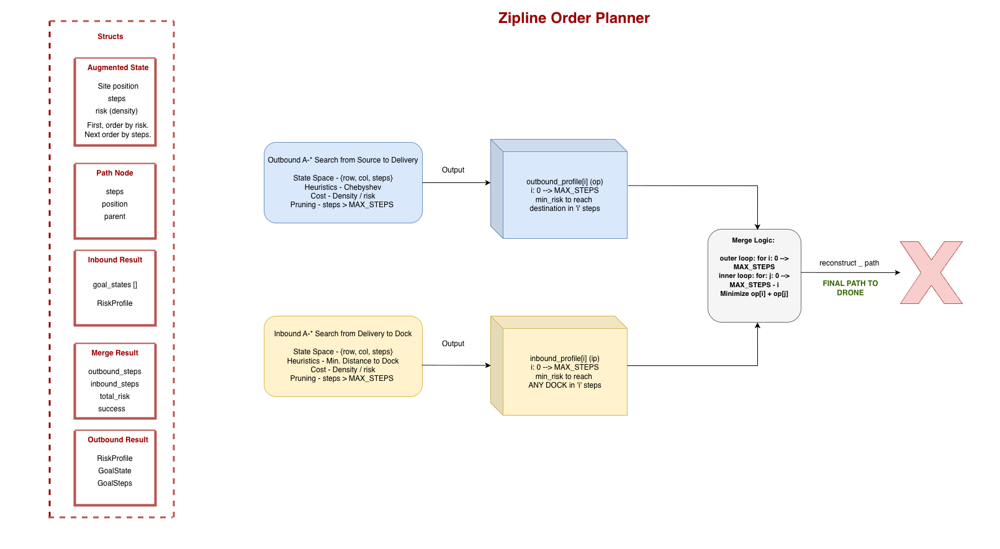
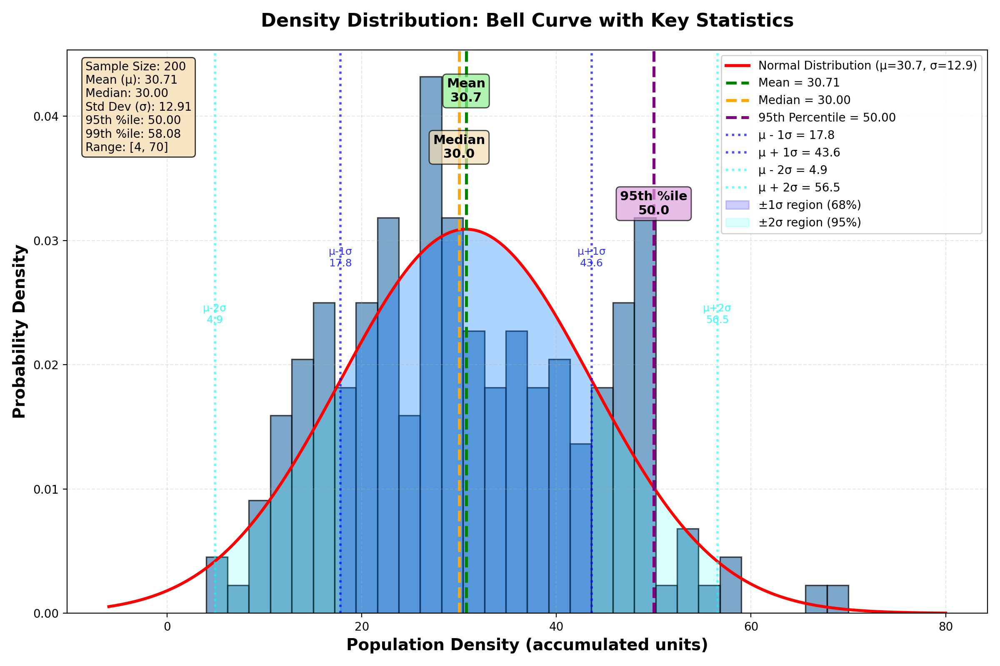

# Solution: Safety Analysis and Daily Order Capacity

## How the Planner Works

The path planner uses a **Constrained Shortest Path Problem (CSPP)** approach to find optimal drone delivery routes. The algorithm operates in three phases:

1. **Outbound Search**: Starting from the origin dock, the planner performs A* search for paths to the delivery location. It explores all possible routes while tracking both the number of steps taken and the accumulated population density (risk) along each path.

2. **Inbound Search**: After delivery, the planner performs A* search from the delivery location to find paths to any available dock. Similar to the outbound phase, it tracks steps and density for all possible routes.

3. **Profile Merging**: The planner combines the results from both phases to find the optimal split between outbound and inbound steps. It selects the combination that minimizes total population density while ensuring the combined path length stays within the 110-step budget.

The algorithm uses an augmented state space where each state represents `(position, steps_taken, accumulated_density)`. This allows the planner to simultaneously optimize for both path length (constrained to ≤110 steps) and population density (minimized). The search uses A*-like heuristics to efficiently explore the space while guaranteeing optimality within the step constraint. (See Appendix A for detailed optimality guarantees.)



### Cost Functions and Heuristics

**Cost Function**: The cost accumulated along a path is the sum of population densities:
```
g(s) = Σ_{i=1}^{steps} density(position_i)
```
where `g(s)` represents the accumulated density (risk) from the start to state `s`.

**Outbound Heuristic**: For the outbound search (origin → delivery), we use the Chebyshev distance (L∞ norm) to the delivery location:
```
h_outbound(s) = max(|e_s - e_delivery|, |n_s - n_delivery|)
```
This heuristic is admissible (never overestimates) because the minimum steps required to reach the goal in an 8-connected grid is exactly the Chebyshev distance.

**Inbound Heuristic**: For the inbound search (delivery → dock), we use a pre-computed distance transform via BFS from all docks:
```
h_inbound(s) = min_{dock ∈ Docks} distance_BFS(s, dock)
```
This heuristic is also admissible as it represents the true minimum steps to reach the nearest dock.

**Priority Queue Ordering**: States are ordered by accumulated density (risk), with ties broken by step count:
```
priority(s) = (g(s), steps(s))
```
This ensures we explore lower-density paths first while maintaining optimality guarantees.

### Space and Time Complexity

The CSPP approach is designed to be efficient and practical for real-time planning in C++:

**Space Complexity**: 
- **State Storage**: For a grid of size `R × C` and maximum steps `B = 110`, the algorithm maintains:
  - `min_risk[R][C][B+1]`: O(R × C × B) = O(R × C × 111) integers
  - `parent_map[R][C][B+1]`: O(R × C × B) shared pointers
- **Priority Queue**: In the worst case, stores O(R × C × B) states, but in practice, the heuristic pruning significantly reduces this.
- **Total Space**: For a typical 70×59 grid (San Francisco map given), this requires approximately:
  - `70 × 59 × 111 × (4 bytes + 8 bytes) ≈ 3.3 MB` for state storage
  - Additional memory for priority queue (typically < 1 MB)
  - **Total: < 5 MB per order**, well within normal C++ memory capacity

**Time Complexity**:
- **Outbound/Inbound Search**: Each search explores at most O(R × C × B) states. With heuristic pruning, the actual number of expanded states is typically much smaller (often 10-20% of the theoretical maximum).
- **Profile Merging**: O(B²) = O(111²) = O(12,321) operations, which is negligible.
- **BFS Precomputation**: O(R × C) for distance-to-docks, computed once per order.
- **Total per Order**: Typically completes in **~250 milliseconds** on modern hardware for the San Francisco map.

**Practical Performance**: The implementation handles 200 orders in approximately 47-50 seconds, demonstrating that the space and time requirements are completely within the handling capacity of standard C++ implementations. The algorithm scales linearly with the number of orders. While not suitable for strict real-time requirements, this performance is acceptable for batch processing of orders, and the algorithm can be optimized further through caching and parallelization (see Appendix C).

## Safety Analysis: Daily Order Capacity

### Methodology

To determine how many orders can be safely fulfilled per day, we analyze the density distribution from our planner's results and apply the given incident probability model.

**Incident Probability Model**: A flight accumulating `d` population density units has an incident probability of `d × 10⁻¹²`.

### Density Statistics



From analysis of 200 orders processed by the planner:

- **Mean density**: 30.71 units
- **Median density**: 30 units
- **95th percentile**: 50 units
- **99th percentile**: 66 units
- **Maximum density**: 70 units

### Daily Incident Probability Calculation

For `n` orders per day, the daily incident probability is:

```
P(daily incident) = 1 - ∏(1 - p_i)
```

where `p_i = density_i × 10⁻¹²` is the incident probability for order `i`.

For small probabilities, this can be approximated using the union bound:

```
P(daily incident) ≈ ∑p_i = n × E[density] × 10⁻¹²
```

### Daily Capacity Estimates

To determine safe daily capacity, we use the 95th percentile density (50 units) to account for worst-case scenarios and variability. We provide estimates for different safety margins:

#### Estimate with 1× Safety Margin (Target: 1 × 10⁻⁸)

Using the target probability directly:

```
n × 50 × 10⁻¹² ≤ 1 × 10⁻⁸
n ≤ (1 × 10⁻⁸) / (50 × 10⁻¹²)
n ≤ 200 orders/day
```

**Estimate: 200 orders per day**

#### Estimate with 1.5× Safety Margin (Target: 6.67 × 10⁻⁹)

Using a 1.5× safety margin (targeting 2/3 of the threshold):

```
n × 50 × 10⁻¹² ≤ 6.67 × 10⁻⁹
n ≤ (6.67 × 10⁻⁹) / (50 × 10⁻¹²)
n ≤ 133.4 orders/day
```

**Recommended Estimate: 133 orders per day**

### Alternative Conservative Estimates (Maximum Density)

Using the maximum observed density (70 units) provides extremely conservative bounds:

**With 1× Safety Margin**:
```
n × 70 × 10⁻¹² ≤ 1 × 10⁻⁸
n ≤ 142.9 orders/day
```

**With 1.5× Safety Margin**:
```
n × 70 × 10⁻¹² ≤ 6.67 × 10⁻⁹
n ≤ 95.3 orders/day
```

These represent extremely conservative estimates assuming every order has the worst-case density.

### Assumptions and Justifications

1. **Independent Flight Incidents**: We assume incidents on different flights are independent events. This is reasonable as each flight operates independently in space and time.

2. **Stationary Density Distribution**: We assume the density distribution of future orders matches the historical distribution analyzed. This is conservative if order patterns remain similar or improve over time.

3. **Union Bound Approximation**: For small probabilities, we use the union bound `P(∪A_i) ≤ ΣP(A_i)`. This is conservative as it overestimates the true probability when events are not mutually exclusive.

4. **95th Percentile Usage**: Using the 95th percentile rather than the mean accounts for:
   - Variability in order characteristics (delivery locations, dock assignments)
   - Potential outliers and edge cases
   - Day-to-day variations in order patterns

5. **Safety Margin**: We provide estimates for both 1× and 1.5× safety margins:
   - **1× margin**: Uses the target probability directly (1 × 10⁻⁸)
   - **1.5× margin**: Targets 6.67 × 10⁻⁹ to provide a buffer for:
     - Model uncertainty in the incident probability formula
     - Unmodeled factors (weather, traffic, system failures)
     - Future changes in order patterns or map characteristics

6. **No Path Degradation**: We assume the planner continues to find optimal paths. If path quality degrades (e.g., due to map changes), densities would increase, making our estimate conservative.

7. **Single Planner Instance**: The analysis assumes a single planner instance. If multiple planners operate in parallel, the daily capacity scales proportionally (e.g., 2 planners → 200 orders/day).

### Conclusion

**Recommended Daily Capacity: 133 orders per day**

This estimate is based on the 95th percentile density (50 units) with a 1.5× safety margin, targeting a daily incident probability of 6.67 × 10⁻⁹. This provides a comfortable buffer below the `10⁻⁸` target while maintaining operational flexibility.

**Summary of Estimates**:

| Safety Margin | 95th Percentile (50 units) | Maximum Density (70 units) |
|---------------|---------------------------|---------------------------|
| 1× (1 × 10⁻⁸) | 200 orders/day | 143 orders/day |
| 1.5× (6.67 × 10⁻⁹) | **133 orders/day** (recommended) | 95 orders/day |

For mission-critical applications requiring maximum safety, the more conservative estimate of 95 orders/day (using maximum density with 1.5× margin) can be used.

The analysis demonstrates that the planner can safely handle a substantial daily order volume while maintaining the required safety standards. The CSPP approach's optimality guarantees ensure that these estimates are based on the best-possible paths within the step constraint.

---

## Appendix

### Appendix A: Optimality Guarantees

The CSPP approach provides **provable optimality** in terms of density minimization subject to the step constraint. The mathematical guarantee is as follows:

**Theorem**: Given a path budget `B = 110` steps, the algorithm finds the path `π*` that minimizes total density:
```
π* = argmin_{π: |π| ≤ B} Σ_{v ∈ π} density(v)
```

**Proof Sketch**:

1. **Complete State Space Exploration**: By augmenting the state space to `S = {(position, steps) : steps ≤ B}`, the algorithm explores all feasible paths. For each state `s = (pos, k)`, it maintains:
   ```
   g*(s) = min_{π: start → s, |π| = k} Σ_{v ∈ π} density(v)
   ```
   This ensures all optimal subpaths are discovered.

2. **Optimal Substructure**: The problem exhibits optimal substructure. If `π* = [s₀, s₁, ..., s_k]` is optimal, then any prefix `[s₀, ..., s_i]` must also be optimal. The algorithm exploits this by storing `g*(s)` and only updating when `g_new(s) < g*(s)`.

3. **Global Optimization via Profile Merging**: The outbound search generates:
   ```
   R_outbound[k] = min_{π: origin → delivery, |π| = k} Σ_{v ∈ π} density(v)
   ```
   Similarly, the inbound search generates:
   ```
   R_inbound[k] = min_{π: delivery → dock, |π| = k} Σ_{v ∈ π} density(v)
   ```
   The merge phase finds:
   ```
   (k₁*, k₂*) = argmin_{k₁ + k₂ < B} (R_outbound[k₁] + R_inbound[k₂])
   ```
   This exhaustive evaluation guarantees the globally optimal solution.

4. **Admissible Heuristics**: The heuristics used are admissible (never overestimate), ensuring A* optimality. The step-based pruning `steps + h(s) > B` is sound because it only eliminates states that cannot reach the goal within the budget.

5. **No Budget Myopia**: Unlike sequential planning, the merge phase evaluates all valid `(k₁, k₂)` pairs simultaneously, preventing suboptimal budget allocation.

### Appendix B: Comparison with Lambda-Based Approach

During development, I explored a weighted A* approach using a lambda parameter to balance density and path length. However, this approach suffered from a **budget myopia problem**:

**The Budget Myopia Problem**: In sequential two-leg planning with a strict step budget, the first leg (origin → delivery) doesn't know how much budget the second leg (delivery → dock) will need. 

**Mathematical Formulation**: The lambda-based approach uses a weighted cost function:
```
cost_leg1(π₁) = Σ_{v ∈ π₁} density(v) + λ × |π₁|
cost_leg2(π₂) = Σ_{v ∈ π₂} density(v) + λ × |π₂|
```
where `λ` is the weight parameter balancing density and path length.

The algorithm sequentially optimizes:
```
π₁* = argmin_{π₁: origin → delivery} cost_leg1(π₁)
π₂* = argmin_{π₂: delivery → dock, |π₂| ≤ B - |π₁*|} cost_leg2(π₂)
```

**The Problem**: With low `λ` values, `π₁*` aggressively minimizes density by taking long detours, consuming `|π₁*| ≈ 80-95` steps. This leaves only `B - |π₁*| ≈ 15-30` steps for `π₂*`, forcing it to take high-density shortcuts. The result is:
```
Total density = Σ_{v ∈ π₁*} density(v) + Σ_{v ∈ π₂*} density(v)
```
where the second term dominates due to forced high-density paths, paradoxically producing worse total density despite lower `λ` (which should favor density).

**Why CSPP Solves This**: The CSPP approach jointly optimizes:
```
(π₁*, π₂*) = argmin_{π₁, π₂: |π₁| + |π₂| < B} (Σ_{v ∈ π₁} density(v) + Σ_{v ∈ π₂} density(v))
```
This global optimization prevents the first leg from "stealing" budget from the second leg.

### Appendix C: Improvements and Limitations

**Potential Improvements**:

1. **Caching Distance Transforms**: The distance-to-docks BFS computation is currently performed for each order. Since docks are fixed, this could be precomputed once and reused across all orders, reducing per-order computation time.

2. **LRU Cache for Common Delivery Sites**: Many orders may share the same delivery locations. An LRU cache could store risk profiles for frequently accessed delivery sites, avoiding redundant searches. This would be particularly beneficial in high-volume scenarios where certain delivery locations are popular.

3. **Parallel Processing**: The outbound and inbound searches are independent and could be parallelized. Additionally, multiple orders could be processed in parallel if thread-safe data structures are used.

4. **Incremental Profile Updates**: For orders with similar origin/delivery locations, incremental updates to risk profiles could reduce computation.

5. **Adaptive Heuristic Tuning**: The heuristic could be made more informed by incorporating density information, though this would require additional precomputation.

6. **Profile Storage Overhead**: Storing complete risk profiles for all step counts (0-110) may be overkill if only a subset of step counts are feasible. Sparse storage could reduce memory usage.

**Limitations**:

1. **Memory Scaling**: While the current implementation is efficient for the given constraints, scaling to much larger grids (e.g., 1000×1000) or larger step budgets would require significant memory. The space complexity O(R × C × B) grows quickly.

2. **Fixed Step Budget**: The algorithm assumes a fixed step budget of 110. Changing this requires recompilation and affects memory allocation. A more flexible implementation could make this configurable.

3. **Heuristic Quality**: While the Chebyshev and BFS heuristics are admissible, they may not be as tight as density-aware heuristics, potentially leading to more state expansions than necessary.

